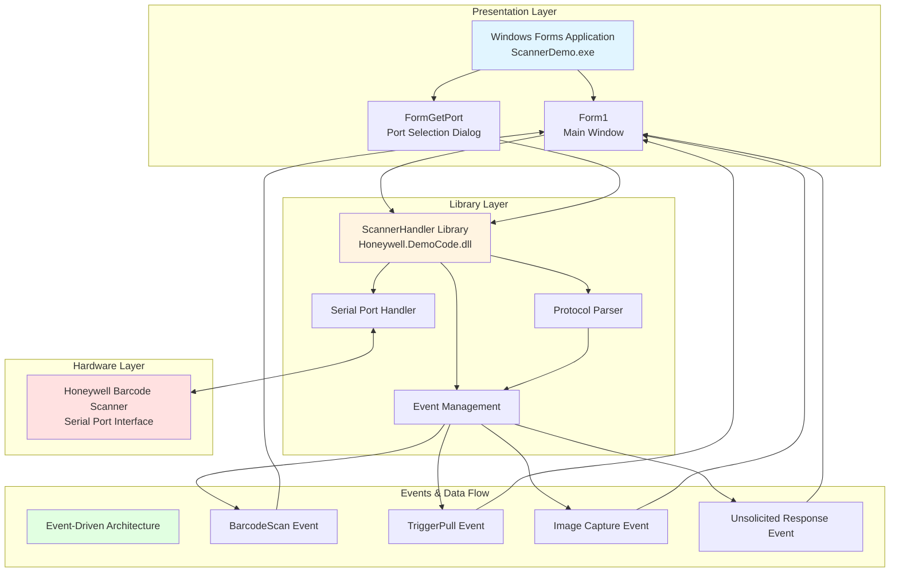

# 1900SDK - Honeywell Barcode Scanner Demo Application

[](https://dotnet.microsoft.com/)
[](https://www.microsoft.com/windows)
[](LICENSE)

A professional demonstration application showcasing integration with Honeywell industrial barcode scanners over serial port connections. This project demonstrates best practices for hardware integration, serial communication, and Windows Forms GUI development.

## 📋 Table of Contents

- [Overview](#overview)
- [System Architecture](#system-architecture)
- [Features](#features)
- [Prerequisites](#prerequisites)
- [Setup & Installation](#setup--installation)
- [Building the Project](#building-the-project)
- [Usage](#usage)
- [API Reference](#api-reference)
- [Project Structure](#project-structure)
- [Development](#development)
- [Troubleshooting](#troubleshooting)
- [Contributing](#contributing)
- [License](#license)

## 🎯 Overview

The **1900SDK** is a Windows desktop application developed by Honeywell International Inc. that demonstrates professional patterns for interfacing with Honeywell industrial barcode scanners. The application provides:

- Real-time barcode scanning and data capture
- Live video preview from scanner camera
- Image capture with multiple methods (synchronous and asynchronous)
- Hardware illumination control
- Event-driven architecture for scanner events
- Professional serial port communication at 115200 baud

**Status**: Demonstration/Educational code (Unsupported)
**Copyright**: © 2011 Honeywell International Inc.
**Version**: 1.1.0.0

## 🏗️ System Architecture

The application follows a clean two-tier architecture pattern separating hardware communication from presentation logic:



### Architecture Components

#### **1. ScannerHandler Library (Communication Layer)**
- **Namespace**: `Honeywell.DemoCode`
- **Type**: Class Library (.dll)
- **Responsibilities**:
  - Serial port communication (115200 baud)
  - Protocol message parsing (MSGGET, TRGEVT, IMGSHP)
  - Event-driven API for scanner interactions
  - Thread-safe background listener
  - Resource management (IDisposable pattern)

#### **2. ScannerDemo Application (Presentation Layer)**
- **Type**: Windows Forms Executable (.exe)
- **Responsibilities**:
  - User interface and visualization
  - Video preview display
  - Barcode result presentation
  - Scanner control interface
  - Event subscription and UI updates

#### **3. Communication Protocol**
- **Baud Rate**: 115200
- **Buffer Size**: 50KB (expandable to 600KB for images)
- **Control Characters**: SYN (0x16), ACK (0x06), NAK (0x15), ENQ (0x05)
- **Message Format**: `SYN + message data + checksum`

#### **4. Message Types**
- **MSGGET**: Barcode scan data with AIM ID, modifier, and content
- **TRGEVT**: Trigger pull/release events
- **IMGSHP**: Image shipment (JPG format from scanner camera)

## ✨ Features

### Core Functionality
- ✅ **Barcode Scanning**: Real-time barcode data capture with AIM symbology identification
- ✅ **Video Preview**: Live camera feed from scanner
- ✅ **Image Capture**: Multiple capture modes (blocking and asynchronous)
- ✅ **Trigger Events**: Hardware trigger detection and event notification
- ✅ **Illumination Control**: Scanner LED/illumination management
- ✅ **Command Interface**: Send custom menu commands to scanner
- ✅ **Event-Driven Architecture**: Non-blocking, responsive UI
- ✅ **Thread-Safe Design**: Proper synchronization between hardware and UI threads

### Technical Features
- 🔧 Component-based design with proper lifecycle management
- 🔧 IDisposable pattern for resource cleanup
- 🔧 Background thread for serial port monitoring
- 🔧 Thread-safe event raising
- 🔧 Robust error handling and recovery
- 🔧 Cross-thread UI updates with proper marshaling

## 📦 Prerequisites

### Software Requirements
- **Operating System**: Windows 7 or later
- **.NET Framework**: 3.5 or higher
- **Development IDE**: Visual Studio 2015 or later (for building from source)
- **MSBuild**: Included with Visual Studio or .NET SDK

### Hardware Requirements
- **Scanner**: Honeywell barcode scanner with serial port interface
- **Serial Port**: Available COM port (USB-to-Serial adapter supported)
- **Drivers**: Appropriate serial port drivers installed

### Optional Tools
- **Git**: For version control and cloning the repository
- **Draw.io**: For viewing/editing the architecture diagram (`Untitled Diagram.xml`)

## 🚀 Setup & Installation

### 1. Clone the Repository

```bash
git clone <repository-url>
cd 1900SDK
```

### 2. Hardware Setup

1. **Connect Scanner**:
   - Connect Honeywell barcode scanner to an available serial port
   - Note the COM port number (e.g., COM3, COM4)
   - Ensure the scanner is powered on

2. **Verify Connection**:
   - Open Device Manager (`devmgmt.msc`)
   - Expand "Ports (COM & LPT)"
   - Verify your scanner appears in the list
   - Note the COM port number

### 3. Install Dependencies

Ensure .NET Framework 3.5 is installed:

**Windows 10/11**:
```powershell
# Enable .NET Framework 3.5 via PowerShell (Administrator)
DISM /Online /Enable-Feature /FeatureName:NetFx3 /All
```

**Alternative Method**:
- Control Panel → Programs → Turn Windows features on or off
- Check ".NET Framework 3.5 (includes .NET 2.0 and 3.0)"
- Click OK and restart if prompted

### 4. Development Environment Setup

If you plan to build from source:

1. **Install Visual Studio**:
   - Visual Studio 2015 or later
   - Workload: ".NET desktop development"
   - Components: .NET Framework 3.5 development tools

2. **Verify MSBuild**:
```powershell
# Check MSBuild is available
msbuild -version
```

## 🔨 Building the Project

### Option 1: Visual Studio

1. Open the solution:
```powershell
cd "Scanner Demo Source"
# Double-click ScannerDemo.sln or use:
start ScannerDemo.sln
```

2. Build the solution:
   - Press `F6` or
   - Menu: Build → Build Solution
   - Or right-click solution → Build

### Option 2: Command Line (MSBuild)

**Debug Build**:
```powershell
cd "Scanner Demo Source"
msbuild ScannerDemo.sln /p:Configuration=Debug /p:Platform="Any CPU"
```

**Release Build**:
```powershell
msbuild ScannerDemo.sln /p:Configuration=Release /p:Platform="Any CPU"
```

**Clean Build**:
```powershell
# Clean all build artifacts
msbuild ScannerDemo.sln /t:Clean

# Rebuild (clean + build)
msbuild ScannerDemo.sln /t:Rebuild /p:Configuration=Release
```

### Build Output Locations

- **Debug**: `Scanner Demo Source/ScannerDemo/bin/Debug/`
- **Release**: `Scanner Demo Source/ScannerDemo/bin/Release/`

### Build Artifacts

After a successful build, you'll find:
```
bin/[Debug|Release]/
├── ScannerDemo.exe           # Main application
├── ScannerHandler.dll        # Communication library
├── ScannerDemo.pdb           # Debug symbols
├── ScannerHandler.pdb        # Library debug symbols
└── beep.wav                  # Audio feedback resource
```

## 📖 Usage

### Running the Application

1. **Launch the executable**:
```powershell
cd "Scanner Demo Source/ScannerDemo/bin/Debug"
./ScannerDemo.exe
```

2. **Select Serial Port**:
   - On startup, the port selection dialog appears
   - Choose the COM port connected to your scanner
   - Click OK to connect

3. **Main Application Window**:
   - The main interface appears
   - Video preview displays scanner camera feed
   - Barcode scan results appear in the data area

### Basic Operations

#### Scanning Barcodes
1. Point scanner at a barcode
2. Pull the trigger
3. Scan data appears in the application
4. AIM symbology information is displayed

#### Capturing Images
1. Click "Capture Image" button
2. Choose capture method:
   - **Blocking**: Synchronous capture (UI waits)
   - **Async**: Asynchronous capture (non-blocking)
3. Image displays in preview area
4. Image is saved to `LastImage` property

#### Controlling Illumination
1. Use illumination controls in the UI
2. Send custom illumination commands
3. Verify scanner LED behavior

#### Sending Custom Commands
1. Enter menu command in command text box
2. Check "Capture Response" if needed
3. Click "Send Command"
4. Response appears in output area

### Event Handling

The application responds to these scanner events:

| Event | Trigger | Response |
|-------|---------|----------|
| `BarcodeScan` | Successful barcode decode | Display barcode data with AIM ID |
| `TriggerPull` | Hardware trigger pressed | Update UI trigger status |
| `UnsolicitedResponse` | Scanner sends unsolicited data | Display in response area |
| Image Capture | Image capture complete | Display image in preview |

## 📚 API Reference

### ScannerHandler Class

**Namespace**: `Honeywell.DemoCode`

#### Constructor
```csharp
public ScannerHandler(string portName)
```
Creates and opens a connection to the scanner on the specified port.

**Parameters**:
- `portName` (string): COM port name (e.g., "COM3")

**Example**:
```csharp
var scanner = new ScannerHandler("COM3");
```

#### Properties

```csharp
public bool IsOpen { get; }
```
Gets whether the serial port connection is currently open.

```csharp
public Image LastImage { get; }
```
Gets the most recently captured image from the scanner.

#### Methods

```csharp
public string SendMenuCommand(string command, bool captureResponse)
```
Sends a menu command to the scanner and optionally captures the response.

**Parameters**:
- `command` (string): Menu command to send
- `captureResponse` (bool): Whether to wait for and return the response

**Returns**: Response string if `captureResponse` is true, otherwise null

**Example**:
```csharp
string response = scanner.SendMenuCommand("IMGSHP.", true);
```

```csharp
public void Close()
```
Closes the serial port connection.

```csharp
public override void Dispose()
```
Disposes of the scanner handler and releases all resources.

#### Events

```csharp
public event EventHandler<BarcodeEventArgs> BarcodeScan
```
Raised when a barcode is successfully scanned.

**Event Args**:
```csharp
public class BarcodeEventArgs : EventArgs
{
    public string AimId { get; }      // AIM symbology identifier
    public string Modifier { get; }   // AIM modifier character
    public string Barcode { get; }    // Decoded barcode data
}
```

**Example**:
```csharp
scanner.BarcodeScan += (sender, e) => {
    Console.WriteLine($"AIM: {e.AimId}, Data: {e.Barcode}");
};
```

```csharp
public event EventHandler TriggerPull
```
Raised when the scanner trigger is pulled or released.

```csharp
public event EventHandler<ResponseEventArgs> UnsolicitedResponse
```
Raised when the scanner sends an unsolicited response.

**Event Args**:
```csharp
public class ResponseEventArgs : EventArgs
{
    public string Response { get; }   // Unsolicited response message
}
```

### Usage Example

```csharp
using Honeywell.DemoCode;
using System;
using System.Drawing;

class Program
{
    static void Main()
    {
        // Create scanner handler
        using (var scanner = new ScannerHandler("COM3"))
        {
            // Subscribe to events
            scanner.BarcodeScan += OnBarcodeScan;
            scanner.TriggerPull += OnTriggerPull;

            // Send command
            string response = scanner.SendMenuCommand("IMGSHP.", true);

            // Access last image
            Image lastImage = scanner.LastImage;

            Console.WriteLine("Press any key to exit...");
            Console.ReadKey();
        } // Automatically disposes and closes port
    }

    static void OnBarcodeScan(object sender, BarcodeEventArgs e)
    {
        Console.WriteLine($"Scanned: {e.Barcode} (Type: {e.AimId})");
    }

    static void OnTriggerPull(object sender, EventArgs e)
    {
        Console.WriteLine("Trigger pulled!");
    }
}
```

## 📁 Project Structure

```
1900SDK/
├── README.md                           # This file
├── CLAUDE.md                           # Detailed AI assistant guide
├── .gitignore                          # Git ignore patterns
├── Untitled Diagram.xml                # Draw.io architecture diagram
│
└── Scanner Demo Source/                # Main source directory
    ├── ScannerDemo.sln                 # Visual Studio solution (2 projects)
    │
    ├── ScannerDemo/                    # UI Application Project
    │   ├── ScannerDemo.csproj          # Project file (Windows executable)
    │   ├── Program.cs                  # Application entry point
    │   ├── Form1.cs                    # Main window implementation
    │   ├── Form1.Designer.cs           # Auto-generated UI code
    │   ├── Form1.resx                  # Form resources
    │   ├── FormGetPort.cs              # Port selection dialog
    │   ├── FormGetPort.Designer.cs     # Auto-generated dialog code
    │   ├── FormGetPort.resx            # Dialog resources
    │   ├── beep.wav                    # Audio feedback resource
    │   ├── Scanner.ico                 # Application icon
    │   └── Properties/                 # Assembly metadata
    │       ├── AssemblyInfo.cs         # Version and company info
    │       ├── Resources.resx          # Embedded resources
    │       ├── Resources.Designer.cs   # Auto-generated resource accessors
    │       ├── Settings.settings       # Application settings
    │       └── Settings.Designer.cs    # Auto-generated settings code
    │
    └── ScannerHandler/                 # Communication Library Project
        ├── ScannerHandler.csproj       # Project file (Class library)
        ├── ScannerHandler.cs           # Core serial communication class
        └── Properties/
            └── AssemblyInfo.cs         # Assembly metadata
```

### Key Files

| File | Description |
|------|-------------|
| `ScannerHandler.cs` | Core serial communication and protocol handling |
| `Form1.cs` | Main application window with scanner interface |
| `FormGetPort.cs` | Serial port selection dialog |
| `Program.cs` | Application entry point and initialization |
| `CLAUDE.md` | Comprehensive developer documentation |

## 🛠️ Development

### Coding Standards

- **Naming Conventions**:
  - Classes: `PascalCase`
  - Methods: `PascalCase`
  - Properties: `PascalCase`
  - Events: `PascalCase`
  - Private fields: `camelCase`

- **Design Patterns**:
  - Component pattern for lifecycle management
  - Event-driven architecture
  - Observer pattern for scanner events
  - Proper IDisposable implementation

- **Thread Safety**:
  - Volatile fields for inter-thread communication
  - ManualResetEvent for synchronization
  - Thread-safe event raising with null-conditional operator
  - UI thread marshaling with `Control.Invoke`

### Important Development Rules

#### ✅ DO's
- ✅ Implement proper resource cleanup (IDisposable)
- ✅ Use `using` statements for disposable objects
- ✅ Maintain thread safety in event handlers
- ✅ Clone images before storing (avoid GDI+ stream issues)
- ✅ Keep library layer UI-independent
- ✅ Follow existing architectural patterns

#### ❌ DON'Ts
- ❌ Never manually edit `.Designer.cs` files
- ❌ Don't block the UI thread with serial operations
- ❌ Don't leave serial ports open without cleanup
- ❌ Don't mix UI code in the library layer
- ❌ Don't remove existing protocol comments
- ❌ Don't upgrade .NET Framework without testing

### Adding New Features

#### 1. Adding Scanner Commands

Edit `ScannerHandler.cs`:

```csharp
public bool SetScanTimeout(int milliseconds)
{
    string command = $"SCNTO{milliseconds}.";
    string response = SendMenuCommand(command, true);
    return response?.Contains("ACK") ?? false;
}
```

#### 2. Adding Events

```csharp
// 1. Define event arguments
public class CustomEventArgs : EventArgs
{
    public string Data { get; set; }
}

// 2. Declare event
public event EventHandler<CustomEventArgs> CustomEvent;

// 3. Raise in listener thread
protected virtual void OnCustomEvent(CustomEventArgs e)
{
    CustomEvent?.Invoke(this, e);
}

// 4. Subscribe in UI
scannerHandler.CustomEvent += ScannerHandler_CustomEvent;
```

### Git Workflow

#### Branch Strategy
- Development branch: `claude/add-readme-architecture-01QQ25M6ZiNk2hKeWntA7We5`
- Feature branches: Create from development branch

#### Commit Guidelines
```bash
# Stage changes
git add .

# Commit with descriptive message
git commit -m "Add feature: description of changes"

# Push to development branch
git push -u origin claude/add-readme-architecture-01QQ25M6ZiNk2hKeWntA7We5
```

## 🔍 Troubleshooting

### Build Issues

#### Error: Cannot find ScannerHandler reference
**Solution**:
```powershell
# Rebuild ScannerHandler first
msbuild "Scanner Demo Source/ScannerHandler/ScannerHandler.csproj" /t:Rebuild
# Then build main solution
msbuild "Scanner Demo Source/ScannerDemo.sln" /t:Rebuild
```

#### Error: Missing .NET Framework 3.5
**Solution**:
```powershell
# Enable via PowerShell (Administrator)
DISM /Online /Enable-Feature /FeatureName:NetFx3 /All
```

### Runtime Issues

#### Error: "Port already in use"
**Causes**:
- Another application is using the serial port
- Previous instance didn't dispose properly
- Port locked by system

**Solutions**:
1. Close all applications using the port
2. Check Device Manager for conflicts
3. Restart the computer to release locked ports
4. Ensure proper `Dispose()` is called

#### Error: "Access denied" on serial port
**Solutions**:
- Run application as Administrator
- Check port permissions in Device Manager
- Verify port is not locked by another process
- Update serial port drivers

#### Images not displaying
**Causes**:
- Image not cloned before storage
- Insufficient memory for large images
- Scanner not sending IMGSHP messages

**Solutions**:
```csharp
// Always clone images
Image img = (Image)Image.FromStream(stream).Clone();

// Dispose old images
if (LastImage != null)
{
    LastImage.Dispose();
}
LastImage = img;
```

### Scanner Connection Issues

#### Scanner not responding
**Checklist**:
1. ✅ Verify scanner is powered on
2. ✅ Check USB/serial cable connection
3. ✅ Confirm correct COM port selected
4. ✅ Verify baud rate is 115200
5. ✅ Check Device Manager for port status
6. ✅ Try different USB port or cable
7. ✅ Restart scanner and application

#### No barcode scan events
**Checklist**:
1. ✅ Verify event handler is subscribed
2. ✅ Check scanner trigger is working
3. ✅ Ensure barcode is supported symbology
4. ✅ Verify illumination is adequate
5. ✅ Check scanner configuration

## 🤝 Contributing

### Contribution Guidelines

1. **Fork the Repository**
```bash
git fork <repository-url>
```

2. **Create Feature Branch**
```bash
git checkout -b feature/your-feature-name
```

3. **Make Changes**
- Follow coding standards
- Add appropriate comments
- Test thoroughly with hardware

4. **Commit Changes**
```bash
git add .
git commit -m "Add feature: descriptive message"
```

5. **Push and Create Pull Request**
```bash
git push origin feature/your-feature-name
# Create PR on GitHub
```

### Code Review Checklist

- [ ] Code follows naming conventions
- [ ] Proper resource disposal implemented
- [ ] Thread safety maintained
- [ ] No UI code in library layer
- [ ] Designer files not manually edited
- [ ] Comments added for complex logic
- [ ] Tested with actual hardware
- [ ] No memory leaks introduced

## 📄 License

**Copyright © 2011 Honeywell International Inc.**

This is proprietary demonstration code provided for educational purposes. All rights reserved.

**Status**: Unsupported demonstration code

For hardware-related questions, contact Honeywell support.
For code-related questions, use GitHub issues.

## 📞 Support & Resources

### Documentation
- **CLAUDE.md**: Comprehensive developer guide with detailed architecture
- **API Reference**: See [API Reference](#api-reference) section above
- **Architecture Diagram**: `Untitled Diagram.xml` (open with Draw.io)

### External Resources
- [.NET Framework Documentation](https://docs.microsoft.com/dotnet)
- [Serial Port Programming Guide](https://docs.microsoft.com/en-us/dotnet/api/system.io.ports.serialport)
- [Honeywell Scanner Documentation](https://www.honeywellaidc.com) (hardware-specific)
- [AIM Barcode Symbology Standards](https://www.aimglobal.org)

### Getting Help

1. **Check Documentation**: Review CLAUDE.md and this README
2. **Search Issues**: Check existing GitHub issues
3. **Create Issue**: Open new issue with:
   - Description of problem
   - Steps to reproduce
   - Expected vs actual behavior
   - System information
   - Error messages/logs

---

**Made with ❤️ by Honeywell International Inc.**

*For demonstration and educational purposes*
